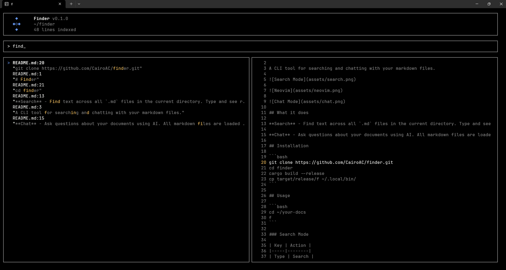
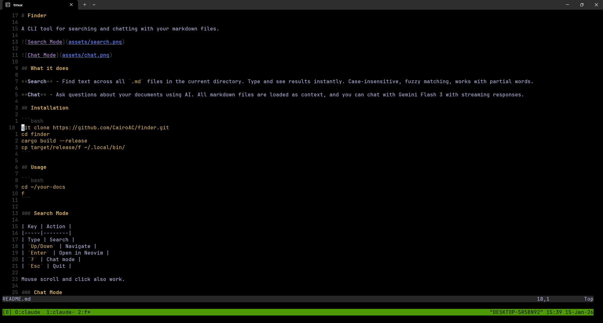
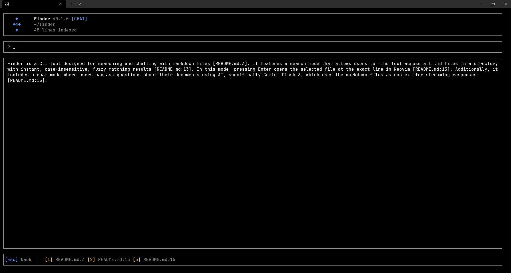
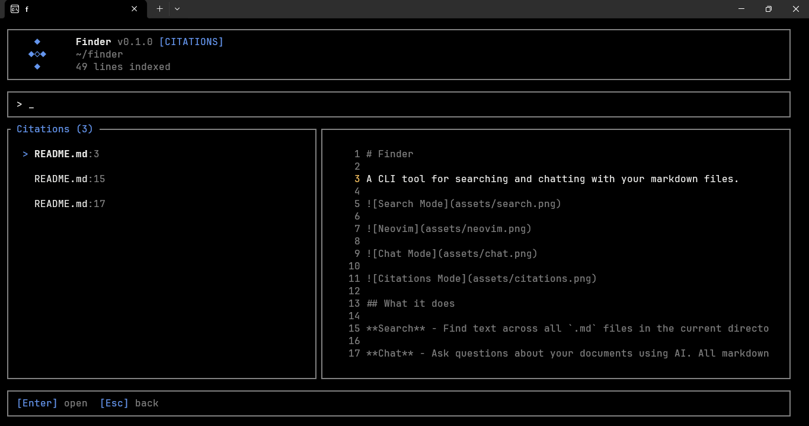

# Finder

A CLI tool for searching and chatting with your markdown files.









## What it does

**Search** - Find text across all `.md` files in the current directory. Type and see results instantly. Case-insensitive, fuzzy matching, works with partial words. Matched characters are highlighted. A live preview pane shows the file content with the matched line centered. Press Enter to open in Neovim at the exact line.

**Chat** - Ask questions about your documents using AI. All markdown files are loaded as context, and you can chat with Gemini Flash 3 with streaming responses. The AI includes citations to specific lines. Press `Alt+c` to browse and search citations with a preview pane.

## Installation

```bash
cargo install --git https://github.com/CairoAC/finder.git
```

### Update

```bash
f --update
```

The tool checks for updates on startup and notifies you when a new version is available.

## Usage

```bash
cd ~/your-docs
f
```

### Search Mode

| Key | Action |
|-----|--------|
| Type | Search |
| `Up/Down` | Navigate |
| `Enter` | Open in Neovim |
| `?` | Chat mode |
| `Esc` | Quit |

Mouse scroll and click also work.

### Chat Mode

Press `?` to chat with your documents.

| Key | Action |
|-----|--------|
| Type | Write question |
| `Enter` | Send |
| `Alt+c` | Browse citations |
| `Ctrl+C` | Cancel stream |
| `Esc` | Back to search |

### Citations Mode

Press `Alt+c` in chat mode to browse citations.

| Key | Action |
|-----|--------|
| Type | Filter citations |
| `Up/Down` | Navigate |
| `Enter` | Open in Neovim |
| `Esc` | Back to chat |

## Chat Setup

For chat mode, add your OpenRouter API key:

```bash
echo 'OPENROUTER_API_KEY=sk-or-...' >> ~/.env
```

## Dependencies

- Rust 1.70+
- Neovim
- OpenRouter API key (optional, for chat)

## License

MIT

